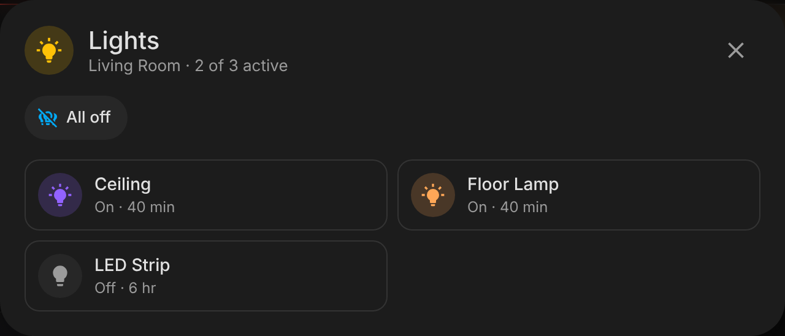

# Area Pulse Card

[](https://hacs.xyz)

A modern, area-aware dashboard card for Home Assistant. Pick an area and it shows everything that matters about that room at a glance — presence and how long it's been occupied, temperature and humidity, open doors and windows, safety alerts, what's playing, low batteries — plus a row of quick actions (lights, covers, scenes, "vacuum this room", all off).

It is built to sit next to the built-in Tile and Area cards without looking out of place: it uses `ha-card`, your theme's variables and Home Assistant's colour tokens, opens the native more-info dialogs, and hands every action to Home Assistant's own action handler (so confirmations, `navigate`, `perform-action`, etc. behave exactly like the core cards).




## Features

- **Zero config** — select an area; entities are discovered from the entity and device registries (device → area inheritance included, hidden and config entities skipped).
- **Label filter** — an area with hundreds of entities? Tag the few that matter with a Home Assistant label and tell the card to show only those (or to hide everything carrying another label). See [Filtering by labels](#filtering-by-labels).
- **Presence first** — occupancy/presence sensors (mmWave etc.) drive an "Occupied for 12 min / Clear for 2 h" line and a live presence dot; falls back to motion sensors when the room has no presence sensor.
- **Main light on the area icon** — tap the icon to toggle the room's main light, hold for its dialog. The icon and the ambient glow take the light's actual colour (RGB, colour temperature or hue/saturation) and the glow scales with brightness. Auto-detected (the only light, or one named ceiling/main/κεντρικό…), or set `main_light`.
- **Climate at a glance** — uses the area's own temperature/humidity sensor setting when present, otherwise the median of all sensors (same rule as the core area card). Outside the comfort band, temperature turns blue (cold) or red (warm) and humidity white (dry) or blue (humid). On light themes "dry" uses a pale blue-grey, because white text is invisible on a white card. All four colours are configurable.
- **Two rows of status chips** — first row: motion, doors, windows (what's open or moving); second row: everything else — heating/cooling, lights, smart plugs and switches, fans, covers, locks, media (shows the track title), low batteries and extra readings. Which groups go in the first row is configurable.
- **Group popup** — tapping a chip that covers several entities (e.g. "2 lights on") opens a popup with a native Home Assistant tile per entity, brightness slider included for dimmable lights, plus an "All off / All on" (or open/close all, pause all) button. Opening an entity's dialog from the popup steps it aside and brings it back when you close the dialog. On phones the popup is a bottom sheet. A chip with a single entity opens its more-info dialog directly.
- **Safety alerts** — moisture, smoke, gas, CO, safety, problem, tamper: red banner and red card outline as soon as one trips.
- **Extra readings** — optional CO₂ (colour-coded at 1000/1500 ppm), PM2.5, VOC, illuminance, pressure, power (summed), energy, noise.
- **Quick actions** — presets or any entity / any HA action, with tap, hold and double-tap.
- **Ambient cues** — light-coloured glow while lights are on, optional area picture blended into the background.
- **Sections-ready** — `getGridOptions` for the sections view, container queries for narrow columns, a `compact` layout.
- **Visual editor** — built on HA's own `ha-form` selectors; YAML optional.
- **Localised** — English and Greek; numbers, units and relative times use your HA locale.

## Installation

### HACS (custom repository)

1. HACS → ⋮ → **Custom repositories** → add `https://github.com/zacharatos/area-pulse-card`, type **Dashboard**.
2. Search for **Area Pulse Card** → **Download**.
3. Reload the browser (clear cache if the card doesn't show up in the picker).

### Manual

1. Copy `dist/area-pulse-card.js` to `<config>/www/area-pulse-card.js`.
2. Settings → Dashboards → ⋮ → **Resources** → add `/local/area-pulse-card.js` as a *JavaScript module*.

Requires Home Assistant **2025.7+** (registry data on the frontend, colour tokens). The `vacuum_area` preset needs **2026.3+** and a vacuum whose segments are mapped to areas.

## Configuration

Minimal:

```yaml
type: custom:area-pulse-card
area: living_room
```

Full example:

```yaml
type: custom:area-pulse-card
area: living_room
name: Living
icon: mdi:sofa
color: light-blue            # HA colour token or any CSS colour
layout: default              # default | compact
show_picture: true
show_inactive: false         # also show "Windows closed", "Lights off", ...
main_light: light.living_room_ceiling   # optional; auto-detected
colors:
  temperature_low: blue
  temperature_high: red
  humidity_low: white
  humidity_high: blue
temperature_entity: sensor.living_room_temperature
comfort_temperature: { min: 20, max: 24 }
comfort_humidity: { min: 40, max: 60 }
sensor_classes: [carbon_dioxide, illuminance]
groups: [alerts, motion, doors, windows, climate, lights, switches, media, batteries]
top_groups: [motion, doors, windows]
exclude_entities: [binary_sensor.living_room_tv_motion]
label_filter:
  include: [Living room card]   # label name or ID
  exclude: [Hidden]
battery_threshold: 20
tap_action:
  action: navigate
  navigation_path: /dashboard-home/living-room
actions:
  - preset: lights_toggle
  - entity: scene.movie_night
    name: Movie
    icon: mdi:movie-open
  - preset: vacuum_area
    entity: vacuum.roborock
  - preset: everything_off
```

### Card options

| Option | Type | Default | Description |
| --- | --- | --- | --- |
| `area` | string | **required** | Area ID. |
| `name` / `icon` | string | area's | Override the area name / icon. |
| `color` | string | `primary` | Accent for the occupied state and plain entity actions. |
| `layout` | `default` \| `compact` | `default` | Compact shrinks everything and uses icon-only inactive chips and actions. |
| `show_picture` | bool | `true` | Blend the area picture into the card background. |
| `show_inactive` | bool | `false` | Show groups with nothing active ("Doors closed"). |
| `main_light` | entity | auto | Light the area icon toggles and whose colour tints the icon and glow. |
| `link_main_light` | bool | `true` | Set `false` to keep the area icon passive. |
| `colors` | map | see below | `temperature_low` (blue), `temperature_high` (red), `humidity_low` (white; pale blue-grey on light themes), `humidity_high` (blue). HA colour tokens or CSS colours. |
| `temperature_entity` / `humidity_entity` | entity | area setting → median | Explicit climate sensors. |
| `comfort_temperature` / `comfort_humidity` | `{min,max}` or `[min,max]` | `19–25 °C` (`68–76 °F`) / `35–65 %` | Comfort band used for colouring. |
| `sensor_classes` | list | `[]` | Extra readings: `illuminance`, `carbon_dioxide`, `pm25`, `volatile_organic_compounds`, `pressure`, `power`, `energy`, `sound_pressure`. |
| `groups` | list | all | Which status chips to show, in order: `alerts`, `motion`, `doors`, `windows`, `climate`, `lights`, `switches`, `fans`, `covers`, `locks`, `media`, `batteries`. |
| `top_groups` | list | `motion, doors, windows` | Groups placed in the first chip row; every other group goes in the second row. |
| `alert_classes` | list | `moisture, smoke, gas, carbon_monoxide, safety, problem, tamper` | Binary-sensor device classes treated as alerts. |
| `presence_entities` | list | auto | Force which entities define presence (e.g. a template or `input_boolean`). |
| `exclude_entities` | list | `[]` | Ignore these entities everywhere. |
| `label_filter` | map | none | Only show entities (or devices) carrying certain Home Assistant labels. See [Filtering by labels](#filtering-by-labels). |
| `battery_threshold` | number | `20` | Battery % considered low. |
| `tap_action` / `hold_action` / `double_tap_action` | action | none | Standard HA actions for the header. |
| `actions` | list | `[]` | Quick actions, see below. |

### Filtering by labels

Real areas collect dozens or hundreds of entities: every diagnostic sensor, every bulb in a group, every integration helper. Labels let you choose which ones the card cares about, without listing entities one by one.

1. In Home Assistant open **Settings → Areas, labels & zones → Labels** and create a label (say *Living room card*).
2. Attach it to entities or devices (select several in **Settings → Devices & services → Entities**, then **Add label**). Labelling a *device* covers all of its entities.
3. Tell the card to use it, in the editor under **Filter by labels** or in YAML:

```yaml
type: custom:area-pulse-card
area: living_room
label_filter:
  include: [Living room card]
```

| Key | Default | Description |
| --- | --- | --- |
| `include` | none | Show only entities that carry one of these labels. A single label or a list; label **name** (`Living room card`) or label **ID** (`living_room_card`) both work. The visual editor writes IDs. |
| `exclude` | none | Hide entities that carry any of these labels. **Exclusion always wins** over `include`. Works on its own too: "everything except what is labelled *Hidden*". |
| `match` | `any` | With several `include` labels, `any` needs one of them, `all` needs every one. |
| `from_device` | `true` | Also read labels from the entity's device, so one label on a device brings in all its entities. Set `false` to look at entity labels only. |

Good to know:

- The filter applies to **everything the card derives from the area**: chips, climate readings, presence, the main light, the group popup and battery warnings. Battery sensors are separate entities, so label the *device* (with `from_device` on) and its battery warning comes along.
- The area presets (`lights_on`/`lights_off`/`lights_toggle`, `covers_*`, `fans_off`, `media_stop`, `everything_off`) act on the whole area normally, but with a label filter they act **only on the entities the card shows**, so "Lights off" never switches off lights you kept off the card.
- Entities you name explicitly (`main_light`, `temperature_entity`, `humidity_entity`, `presence_entities`, an `actions` entity) and the sensors set in the area itself are always used, label or not.
- `exclude_entities` still applies on top of the label filter.
- If no entity in the area matches, the card says so and names the labels it was looking for, rather than rendering an empty card.
- Label names are matched case-insensitively. If you rename a label in Home Assistant, the ID stays, so IDs are the safer choice in shared YAML.

### Quick actions

Each item accepts `preset`, `entity`, `name`, `icon`, `color`, `tap_action`, `hold_action`, `double_tap_action`. Anything you set overrides the preset.

| Preset | What it does |
| --- | --- |
| `lights_toggle` | Turns the area's lights off if any is on, otherwise on. Highlights while any light is on. |
| `lights_on` / `lights_off` | `light.turn_on` / `light.turn_off` targeting the area. |
| `covers_open` / `covers_close` | `cover.open_cover` / `cover.close_cover` targeting the area. |
| `fans_off` | `fan.turn_off` targeting the area. |
| `media_stop` | `media_player.media_stop` targeting the area. |
| `vacuum_area` | `vacuum.clean_area` for this area on `entity` (with confirmation). |
| `everything_off` | `homeassistant.turn_off` targeting the area (with confirmation). |

Without a preset, an `entity` button toggles the entity (scenes and scripts run, buttons press) and hold opens more-info. Or give it any `tap_action`:

```yaml
- name: Goodnight
  icon: mdi:weather-night
  tap_action:
    action: perform-action
    perform_action: script.goodnight
    data: { area: bedroom }
```

## Development

```bash
npm install
npm run build        # dist/area-pulse-card.js
npm run watch        # rebuild on change
npm run typecheck    # tsc --noEmit
npm test             # node:test: label filter, area discovery
python3 -m http.server 8765   # then open http://localhost:8765/test/harness.html (?dark=1, ?lang=el)
```

`test/harness.html` renders the card against a mock `hass` object with stubbed `ha-card`/`ha-icon`, which is how the screenshots above were made. Add `?helpers=1` to stub HA's card helpers and exercise the native-tile popup path, or `?rgb=255,120,40` to change the main light's colour. To release, bump the version, tag `vX.Y.Z` and push — the release workflow builds and attaches the bundle.

## License

MIT
