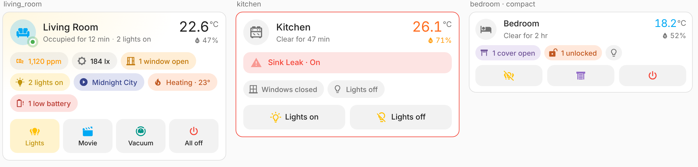
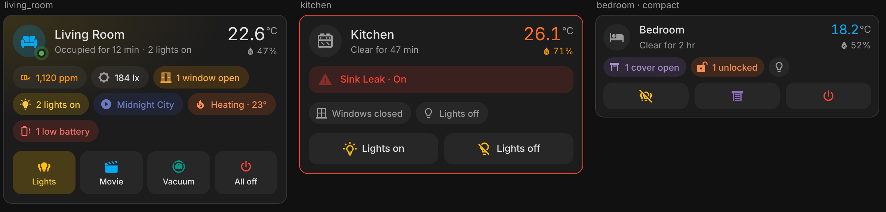

# Area Pulse Card

[](https://hacs.xyz)

A modern, area-aware dashboard card for Home Assistant. Pick an area and it shows everything that matters about that room at a glance — presence and how long it's been occupied, temperature and humidity, open doors and windows, safety alerts, what's playing, low batteries — plus a row of quick actions (lights, covers, scenes, "vacuum this room", all off).

It is built to sit next to the built-in Tile and Area cards without looking out of place: it uses `ha-card`, your theme's variables and Home Assistant's colour tokens, opens the native more-info dialogs, and hands every action to Home Assistant's own action handler (so confirmations, `navigate`, `perform-action`, etc. behave exactly like the core cards).




## Features

- **Zero config** — select an area; entities are discovered from the entity and device registries (device → area inheritance included, hidden and config entities skipped).
- **Presence first** — occupancy/presence sensors (mmWave etc.) drive an "Occupied for 12 min / Clear for 2 h" line and a live presence dot; falls back to motion sensors when the room has no presence sensor.
- **Climate at a glance** — uses the area's own temperature/humidity sensor setting when present, otherwise the median of all sensors (same rule as the core area card). Values turn blue/orange outside a configurable comfort band.
- **Status chips** — doors, windows, covers, locks, lights, fans, media (shows the track title), climate (heating/cooling + target), low batteries. Tap a chip with one entity for more-info, or with several to open an inline list with each entity's state and "since" time.
- **Safety alerts** — moisture, smoke, gas, CO, safety, problem, tamper: red banner and red card outline as soon as one trips.
- **Extra readings** — optional CO₂ (colour-coded at 1000/1500 ppm), PM2.5, VOC, illuminance, pressure, power (summed), energy, noise.
- **Quick actions** — presets or any entity / any HA action, with tap, hold and double-tap.
- **Ambient cues** — warm glow when lights are on, optional area picture blended into the background.
- **Sections-ready** — `getGridOptions` for the sections view, container queries for narrow columns, a `compact` layout.
- **Visual editor** — built on HA's own `ha-form` selectors; YAML optional.
- **Localised** — English and Greek; numbers, units and relative times use your HA locale.

## Installation

### HACS (custom repository)

1. HACS → ⋮ → **Custom repositories** → add `https://github.com/<your-github-user>/area-pulse-card`, type **Dashboard**.
2. Search for **Area Pulse Card** → **Download**.
3. Reload the browser (clear cache if the card doesn't show up in the picker).

### Manual

1. Copy `dist/area-pulse-card.js` to `<config>/www/area-pulse-card.js`.
2. Settings → Dashboards → ⋮ → **Resources** → add `/local/area-pulse-card.js` as a *JavaScript module*.

Requires Home Assistant **2025.7+** (registry data on the frontend, colour tokens). The `vacuum_area` preset needs **2026.3+** and a vacuum whose segments are mapped to areas.

## Configuration

Minimal:

```yaml
type: custom:area-pulse-card
area: living_room
```

Full example:

```yaml
type: custom:area-pulse-card
area: living_room
name: Living
icon: mdi:sofa
color: light-blue            # HA colour token or any CSS colour
layout: default              # default | compact
show_picture: true
show_inactive: false         # also show "Windows closed", "Lights off", ...
temperature_entity: sensor.living_room_temperature
comfort_temperature: { min: 20, max: 24 }
comfort_humidity: { min: 40, max: 60 }
sensor_classes: [carbon_dioxide, illuminance]
groups: [alerts, doors, windows, lights, media, climate, batteries]
exclude_entities: [binary_sensor.living_room_tv_motion]
battery_threshold: 20
tap_action:
  action: navigate
  navigation_path: /dashboard-home/living-room
actions:
  - preset: lights_toggle
  - entity: scene.movie_night
    name: Movie
    icon: mdi:movie-open
  - preset: vacuum_area
    entity: vacuum.roborock
  - preset: everything_off
```

### Card options

| Option | Type | Default | Description |
| --- | --- | --- | --- |
| `area` | string | **required** | Area ID. |
| `name` / `icon` | string | area's | Override the area name / icon. |
| `color` | string | `primary` | Accent for the occupied state and plain entity actions. |
| `layout` | `default` \| `compact` | `default` | Compact shrinks everything and uses icon-only inactive chips and actions. |
| `show_picture` | bool | `true` | Blend the area picture into the card background. |
| `show_inactive` | bool | `false` | Show groups with nothing active ("Doors closed"). |
| `temperature_entity` / `humidity_entity` | entity | area setting → median | Explicit climate sensors. |
| `comfort_temperature` / `comfort_humidity` | `{min,max}` or `[min,max]` | `19–25 °C` (`68–76 °F`) / `35–65 %` | Comfort band used for colouring. |
| `sensor_classes` | list | `[]` | Extra readings: `illuminance`, `carbon_dioxide`, `pm25`, `volatile_organic_compounds`, `pressure`, `power`, `energy`, `sound_pressure`. |
| `groups` | list | all | Which status chips to show, in order: `alerts`, `motion`, `doors`, `windows`, `covers`, `locks`, `lights`, `fans`, `media`, `climate`, `batteries`. |
| `alert_classes` | list | `moisture, smoke, gas, carbon_monoxide, safety, problem, tamper` | Binary-sensor device classes treated as alerts. |
| `presence_entities` | list | auto | Force which entities define presence (e.g. a template or `input_boolean`). |
| `exclude_entities` | list | `[]` | Ignore these entities everywhere. |
| `battery_threshold` | number | `20` | Battery % considered low. |
| `tap_action` / `hold_action` / `double_tap_action` | action | none | Standard HA actions for the header. |
| `actions` | list | `[]` | Quick actions, see below. |

### Quick actions

Each item accepts `preset`, `entity`, `name`, `icon`, `color`, `tap_action`, `hold_action`, `double_tap_action`. Anything you set overrides the preset.

| Preset | What it does |
| --- | --- |
| `lights_toggle` | Turns the area's lights off if any is on, otherwise on. Highlights while any light is on. |
| `lights_on` / `lights_off` | `light.turn_on` / `light.turn_off` targeting the area. |
| `covers_open` / `covers_close` | `cover.open_cover` / `cover.close_cover` targeting the area. |
| `fans_off` | `fan.turn_off` targeting the area. |
| `media_stop` | `media_player.media_stop` targeting the area. |
| `vacuum_area` | `vacuum.clean_area` for this area on `entity` (with confirmation). |
| `everything_off` | `homeassistant.turn_off` targeting the area (with confirmation). |

Without a preset, an `entity` button toggles the entity (scenes and scripts run, buttons press) and hold opens more-info. Or give it any `tap_action`:

```yaml
- name: Goodnight
  icon: mdi:weather-night
  tap_action:
    action: perform-action
    perform_action: script.goodnight
    data: { area: bedroom }
```

## Development

```bash
npm install
npm run build        # dist/area-pulse-card.js
npm run watch        # rebuild on change
python3 -m http.server 8765   # then open http://localhost:8765/test/harness.html (?dark=1, ?lang=el)
```

`test/harness.html` renders the card against a mock `hass` object with stubbed `ha-card`/`ha-icon`, which is how the screenshots above were made. To release, bump the version, tag `vX.Y.Z` and push — the release workflow builds and attaches the bundle.

## License

MIT
